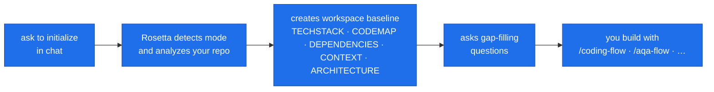

  <picture>
    <source media="(prefers-color-scheme: dark)" srcset="docs/web/assets/brand/rosetta-logo-full-color-white-text.png">
    
  </picture>
  
<strong>Engineering governance and context for AI coding agents — shared instructions, architecture, standards, workflows, and guardrails in every session.</strong>

  

    
    
    
    
    
    
    
    
    
  

## What is Rosetta

https://github.com/user-attachments/assets/6df6e217-3e5c-4691-84ed-7440701a87de

AI coding agents are great — until you try to use them across a real team. Everyone builds their own prompts and instructions, knowledge stays in silos, and the agent — not knowing your architecture or constraints — guesses from a few open files and confidently does the wrong thing.

That's why we built Rosetta — open-source engineering governance and context for AI coding agents. It's not another proprietary agent; it works with the tools you already use (Claude Code, Cursor, Copilot, Codex, and other MCP-compatible agents) and loads your team's shared engineering instructions into every session. Everything is versioned in Git and can run inside your perimeter.

**Teach agents how to think, not what to do.** The model already knows Python and React; what it lacks is your engineering discipline. That's what Rosetta encodes.

Rosetta-guided work follows five phases — **Prepare → Research → Plan → Act → Validate** — with approval gates at the key decision points. Read more in the [Usage Guide](USAGE_GUIDE.md#workflows).

> [!NOTE]
> If you are effectively using your current setup, writing your own skills, and managing AI using your own processes, you probably don't need Rosetta.

## Without Rosetta / With Rosetta

| Without Rosetta                                  | With Rosetta                                  |
| ------------------------------------------------ | --------------------------------------------- |
| Each developer writes their own prompts and instructions | One versioned, shared source of truth   |
| The agent guesses from a few open files          | It reads your architecture and conventions first |
| Starts coding immediately                        | Prepare → research → plan → act → validate    |
| Reviews its own work in the same context         | A fresh-context reviewer subagent checks it   |
| "Generate and hope"                              | Validation with real execution evidence       |
| Knowledge stuck in senior engineers' heads       | Captured once, reused everywhere              |

### Example: "Add rate limiting to the checkout API"

| Without Rosetta                                              | With Rosetta                                                       |
| ------------------------------------------------------------ | ------------------------------------------------------------------ |
| Jumps straight into editing the handler                      | Reads `ARCHITECTURE.md` and your existing conventions first        |
| Misses the shared middleware pattern; duplicates the Redis client | Reuses the shared rate-limiter and Redis layer                |
| No plan, no checkpoint                                       | Proposes a plan and asks for approval                              |
| Ships without running tests                                  | Runs the integration tests, then a fresh-context reviewer validates |

## Quick Start

**1. Install** — pick the option that fits:

| Option                              | Best for                                                                       |
| ----------------------------------- | ------------------------------------------------------------------------------ |
| **[Plugins](PLUGINS.md)** — recommended | Day-to-day developer use (Claude Code · Cursor · Copilot · Codex)          |
| **[Hosted MCP](MCPs.md)**           | Fast evaluation for Windsurf · Junie · Antigravity · OpenCode · any MCP-compatible agent |
| **[Self-hosted MCP](DEPLOYMENT_GUIDE.md)** | Enterprise / air-gapped deployment of the same MCP-compatible setup |

**2. Initialize** — ask the agent in chat once per repo, and Rosetta does the rest:

Full setup and initialization steps are in the [Quickstart](QUICKSTART.md) · [all IDEs and detailed setup](INSTALLATION.md).

## How it works

Rosetta layers your instructions at runtime — core, then organization, then project, each building on the one above — and adapts the result to whatever agent you use:

```mermaid
flowchart LR
    A["<b>Core</b><br/>best practices & workflows"] --> B["<b>Organization</b><br/>standards, policies & guardrails"]
    B --> C["<b>Project</b><br/>architecture, context & constraints"]
    C --> R["<b>Rosetta Runtime</b><br/>context engineering + instruction orchestration"]
    R --> AD["<b>Agent Adapters</b>"]
    AD --> G["<b>Guided Execution</b><br/>workflows • guardrails • validation"]
    G --> T["Claude Code · Cursor · Copilot · Codex · Windsurf"]

    classDef rosetta fill:#1f6feb,stroke:#1b4fb8,color:#ffffff;
    classDef yours fill:#2da44e,stroke:#1a7f37,color:#ffffff;
    classDef third fill:#d0d7de,stroke:#8c959f,color:#1f2328;
    class A,R,AD,G rosetta
    class B,C yours
    class T third
```

**Legend:** 🟦 shipped with Rosetta (Core, Runtime, adapters, execution) · 🟩 authored by your org & project · ⬜ your existing AI tools (third-party).

Higher layers propagate to every project automatically; teams customize without forking. Everything is authored in markdown and versioned in Git.

## Why not just use IDE rules?

IDE rules (`.cursorrules`, `CLAUDE.md`, Copilot custom instructions) are useful, but they are usually local to one tool, one repo, or one developer. Rosetta makes instructions layered, versioned, reusable, and portable across agents and IDEs — organization standards flow into every project, while project-specific context stays local and customizable. On top of that, Rosetta adds the workflows, guardrails, and approval gates that flat rules files do not provide.

## Why use it

| For builders | For organizations |
| --- | --- |
| **Deep project context** — reads your architecture and conventions, not a few open files | **One standard** across every team, tool, model, and repo |
| **Plain-language tasks** — a slash command, no prompt scaffolding or new syntax | **No vendor lock-in** — one instruction set across Claude Code, Cursor, Copilot, Codex; engineers keep their IDEs |
| **Ready-made flows** — coding, testing, AQA, research, and more | **Versioned control** — review, approve, and roll back instructions in Git |
| **Plans and approval gates** before code, not after the damage | **Knowledge captured once** — out of senior engineers' heads |
| **Fresh-context review** and execution-backed validation | **Cross-project intelligence** _(opt-in)_ — agents see the system, not just one repo |
| **Less babysitting** — fewer wrong turns to catch and re-prompt | **Runs inside your perimeter** — air-gap capable; no source code leaves |

See [how Rosetta fits your workflow](OVERVIEW.md#how-rosetta-fits-into-your-workflow) and [how it protects you](USAGE_GUIDE.md#how-rosetta-protects-you).

<b>What Rosetta Adds to AI Coding Agents</b>

## What Rosetta Adds to AI Coding Agents

AI coding agents can read code, generate code, and run commands. But that is only part of what makes software engineering reliable — they are missing much of the discipline a professional engineer brings. Each point below addresses a real, repeatedly observed failure mode, not a theoretical concern.

**Why these problems exist.** LLMs generate tokens sequentially from their current context. If the model passes a point where it should weigh a specific concern — security, an existing convention, an assumption it made three steps ago — it does not reliably circle back. This is not merely a temporary limitation; it is rooted in how autoregressive generation works. A coding agent's system prompt only ensures the model calls the right tools in the right format — it can't carry your project's guardrails, workflows, or quality standards, because it has no idea what you are building: a PoC, a pet project, or enterprise software with regulated data. Rosetta provides that guidance, and tells the agent how and when to load project-specific context so the model acts on it instead of skipping it.

**Why this list is long.** Ask any coding agent to design a full feature workflow and it will give you two or three steps — "write code," "run tests," maybe "make a plan." It rarely thinks to load context first, classify the request, assess risk, separate specs from plans, get approval before implementing, review with fresh eyes, or record lessons learned. Every point below is something agents consistently skip.

1. **Deep project context instead of blind guessing.** Without structured context, coding agents read a few line ranges around the problem and guess the rest. They do not know the architecture, the business rules, the conventions, or the dependencies. They assume. The result is code that appears correct on the surface but violates constraints the agent never knew existed. Imagine hiring a developer from outside your organization, handing them ten lines of code with zero documentation, and asking them to fix the system properly. That is how every coding agent works by default. Planning mode partially addresses this — at much higher token cost — and the agent still has to guess the purpose and target because it has no business context.

   Rosetta instructions reverse this. During repository initialization, the agent — guided by Rosetta — reverse-engineers the project's architecture, tech stack, business context, coding patterns, and dependencies into structured workspace files. The agent reads these before every task. Context loads progressively — bootstrap rules first, then project context, then only the skills and workflow the current task needs. When a query returns more than five documents, Rosetta MCP switches to a listing so the agent picks exactly what it needs. Context stays lean. Reasoning stays sharp. Token efficiency is high because the agent is not loading irrelevant material or re-discovering the project from scratch on every request.

2. **Guardrails and enforced safe behavior.** Coding agents rarely question their own actions. They do not question their understanding. They do not think about whether something is right or wrong. They just do it. They do not reliably assess what they have access to — databases, cloud services, S3 buckets. They do not handle sensitive data with care. They can copy personal data, credentials, and regulated information into logs, messages, and outputs without a second thought. They rarely evaluate whether an action is dangerous or irreversible.

   Rosetta instructions require the agent to: critically review every user request before execution, assess risk of the current environment and available tools, detect and block dangerous and potentially dangerous actions, mask sensitive data and never log or share it, follow transparency rules and behavior boundaries, respect orchestration contracts between agents, and handle deviations when execution diverges from intent. These guardrails load at bootstrap and are treated as required execution constraints — not suggestions the agent can quietly skip.

3. **Human-in-the-loop at decision points, not after the damage.** AI coding agents fully and unconditionally trust user input — even when it is factually incorrect. At the same time, they almost never ask deep questions. When they do ask, the questions are shallow and few. This is the reverse of how collaboration should work. Users are biased, forget to mention critical requirements, provide information without much thought, and rely on common project knowledge that the agent does not have. Once implementation starts, the agent never stops — even when real conflicts or blockers exist in the code. It gets carried away, burns tokens, hallucinates to fill gaps, and delivers the wrong result. There are no checkpoints. There is no pause to verify understanding.

   Rosetta workflows define approval gates at critical decision points: after specs, after plans, before risky actions, before test work continues. The agent batches questions (5–10 per round), prioritizes by impact, and targets a single decision per question. When something is unclear, the agent — instructed by Rosetta — stops and asks instead of guessing. It is almost always cheaper to stop and ask one question than to redo hours of wrong implementation.

4. **Source of truth and request classification.** AI does not establish or maintain a source of truth. It does the opposite — it mixes everything together, confuses its own outputs with ground truth, leaks abstractions, and blends responsibilities. It does not take time to think about systems, actors, relationships, and actions at a foundational level. On brownfield projects this is catastrophic: the agent cannot tell if the existing code is wrong, if the test is wrong, or if the user's request contradicts the actual system behavior. It just tries to make things fit.

   Rosetta instructions require the agent to handle requirements with traceability. Before any work begins, the agent — following Rosetta's bootstrap — auto-classifies every request into one of twelve workflow types: coding, testing, research, requirements, initialization, modernization, code analysis, QA automation, and others. Each type loads entirely different instructions, subagents, skills, and approval gates. A "fix this bug" request follows a completely different path than "analyze this architecture" or "write requirements for checkout." Classification eliminates the guessing that agents do when they receive an unstructured prompt and try to figure out on the fly what kind of work this is.

5. **Analysis before execution.** The majority of AI coding agents are optimized to start implementation as fast as possible. This is the opposite of quality. This is the opposite of enterprise software development, where the cost of an error is extremely high. A bug caught during development costs minutes. The same bug caught after release costs the combined time of the engineer who debugs it, the lead who triages it, QA who verifies the fix, the manager who tracks it, and every person involved in the review, release, and retest cycle. Even a small bug amplifies the total cost by an order of magnitude once it escapes local development.

   Rosetta workflows define explicit preparation, research, planning, and approval phases before any code is written. They instruct the agent to apply SMART, MECE, DRY, and SOLID principles during planning. They separate plans from specs — the plan says what to do and in what order; the spec says what the target state looks like and why. The process scales by task size: small tasks get lightweight planning, medium tasks get full planning with subagents, large tasks get extensive planning with heavy delegation. It is much cheaper to burn 2x tokens and spend a few extra minutes on analysis than to pay for the cascade of rework a missed defect triggers.

6. **Review by separate agent with fresh context.** AI makes mistakes. Sometimes it makes a lot of mistakes. The majority of those mistakes are trivially caught by review — but only if the reviewer has not been part of the implementation. A model reviewing its own work in the same context window rubber-stamps its own decisions. It cannot see its own blind spots. The accumulated assumptions, false starts, and iterative workarounds all feel correct because the model generated them.

   Rosetta workflows instruct the agent to delegate review to a separate subagent with a fresh context window. The reviewer has never seen the debugging session, the failed attempts, or the rationalizations. It inspects the implementation against the original specs and intent. This separation is what makes review actually catch problems instead of confirming the implementer's biases.

7. **Validation with real execution evidence.** Without validation requirements, AI changes multiple files, runs nothing, and declares success. Then it spends three times the original effort trying to fix cascading failures it could have caught immediately. It builds dependent artifacts on top of broken foundations.

   Rosetta instructions require the agent to build, run, and execute real tests at each foundation level before creating dependent work. The validator subagent runs in a clean context with actual execution evidence. This requirement — prove it works before moving on — is simple, and it transforms AI coding from "generate and hope" into "generate, verify, continue."

8. **Workflows designed from observed failure modes.** Ask any AI to create a complete coding workflow from scratch. It will produce something superficial — a few obvious steps that cover maybe 20% of what actually matters. It will focus on one or two concerns and completely forget about everything else. This is not a failure of intelligence. It is a failure of experience. The model has never watched itself fail across hundreds of real tasks and identified the patterns.

   Rosetta contains workflows created by humans who used AI extensively, observed every category of failure, identified root causes, and encoded solutions as structured processes. These workflows cover twelve SDLC activities. Each defines phases, subagents, skills, HITL gates, and artifact expectations. The agent with Rosetta workflows does not become smarter — it stops skipping the steps that matter. It discovers knowledge, conventions, and dependencies it would otherwise miss entirely. It installs the package that another project in the same solution already uses. It distinguishes planning from specs. It performs reviews and checkpoints at the moments where they catch the most errors.

9. **Self-learning and self-organization.** AI coding agents are only now getting basic memory features, but self-learning is not just memory. Self-organization is equally important. AI is fully capable of reorganizing files, restructuring its approach, cleaning up stale information, and adapting based on past mistakes — but it does not do any of this because it was never instructed to. It treats reorganization as deviation from the task. It treats cleanup as out of scope. It treats learning as someone else's job.

   Rosetta instructs the agent to maintain `agents/MEMORY.md` — root causes of errors, actions tried, lessons learned. The agent consults this during planning and records new lessons after failures. It is instructed to reorganize working files when context grows large, and to proactively clean up when work spans many files or sessions.

10. **State persistence turns crashes into checkpoints.** AI coding sessions are fragile. Context loss, timeout, or a crash means starting over. For anything beyond a small fix, this wastes significant time and money. The agent has no memory of what it already completed.

    Rosetta instructs the agent to write execution state — plans, specs, phase progress, flow status — to disk files. If a session fails, the next session resumes from the last recorded checkpoint. Medium and large tasks become resumable multi-session workflows instead of all-or-nothing gambles.

11. **Security by design — no source code leaves your perimeter.** Instruction delivery is deterministic: the agent requests content by tag, not by sending source code for analysis. There is no semantic search over your codebase. No code transfers to Rosetta servers. Write mode is disabled by default and requires explicit deployment configuration to enable. Schema-strict input validation rejects any unexpected payloads. The architecture is air-gap capable and runs entirely inside your organization's perimeter.

12. **One system, every AI tool, customizable at every level.** Rosetta works across Cursor, Claude Code, VS Code, JetBrains, Windsurf, Codex, Antigravity, OpenCode, and any MCP-compatible IDE. Instructions are written once and adapt to each environment. Organizations that switch between AI tools or use multiple tools simultaneously keep their entire instruction investment intact. No vendor lock-in. No per-tool maintenance.

    Three layers merge at runtime: core (universal best practices shipped with Rosetta), organization (your company's conventions and policies), and project (local constraints and context). Teams customize without forking. Improvements to higher layers propagate to every project automatically. Release-based versioning (r1, r2, r3) lets instruction authors develop and test new versions without breaking agents on stable releases. Rollback is immediate. AI behavior is authored in markdown, version-controlled in Git, reviewed in pull requests, and approved before deployment — the same engineering rigor applied to the instructions that control your AI agents.

## Contributing

Use Rosetta plugins to develop Rosetta.

Contributions welcome. See [CONTRIBUTING.md](CONTRIBUTING.md) for workflow and expectations.

## Documentation

| I want to...                                         | Read                                       |
| ---------------------------------------------------- | ------------------------------------------ |
| Set up Rosetta                                       | [QUICKSTART.md](QUICKSTART.md)             |
| Configure your coding-agent workspace                | [CONFIGURATION.md](CONFIGURATION.md)       |
| Understand what Rosetta is and how to think about it | [OVERVIEW.md](OVERVIEW.md)                 |
| Learn how to use Rosetta flows                       | [USAGE_GUIDE.md](USAGE_GUIDE.md)           |
| Deploy Rosetta for my organization                   | [DEPLOYMENT_GUIDE.md](DEPLOYMENT_GUIDE.md) |
| Understand the system architecture                   | [ARCHITECTURE.md](docs/ARCHITECTURE.md)    |
| Navigate the codebase                                | [DEVELOPER_GUIDE.md](DEVELOPER_GUIDE.md)   |
| Contribute a change                                  | [CONTRIBUTING.md](CONTRIBUTING.md)         |
| Debug a problem                                      | [TROUBLESHOOTING.md](TROUBLESHOOTING.md)   |
| See release history                                  | [CHANGELOG.md](CHANGELOG.md)               |
| Security Policy                                      | [SECURITY.md](SECURITY.md)                 |

## Community

- [Website](https://griddynamics.github.io/rosetta/)
- [rosetta-support@griddynamics.com](mailto:rosetta-support@griddynamics.com)

## Notice

> [!WARNING]
> Rosetta is intended for legitimate software engineering workflows.
> Users are responsible for ensuring their use complies with applicable laws, regulations, and contractual obligations.

## For AI Only

Full information: https://griddynamics.github.io/rosetta/llms-full.txt

## License

See [LICENSE](LICENSE) for details.
